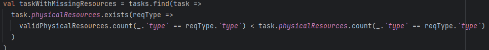

# Executive Summary 
##  Milestone 1 – MVP – Naive scheduling

### Problem Overview
The project aims to develop a functional application for scheduling production orders in a factory. Each product has a linear sequence of tasks, which require specialized physical and human resources. The main objective is to generate a viable production plan based on XML data, following the principles of functional programming.

### Milestone 1 Objectives
Develop an MVP (Minimum Viable Product) with a simplified scheduling algorithm, under the following constraints:
- Production of the products in the order of entry;
- Only one task is executed at a time;
- All resources are available for that task.

### Development Thought
**Reading and Interpreting Input Data (Parsers)**  
The first objective was to ensure correct interpretation of the XML input data. To achieve this, we implemented dedicated parsers for each domain entity (`Order`, `Product`, `Task`, `HumanResource`, `PhysicalResource`, etc.).  
These parsers transformed the XML data into immutable domain models, conforming to the input schema and ready for scheduling.

**Simple Scheduling Logic (FIFO / Sequential)**  

**Generating the Output**  
After scheduling, we generated the final production plan in the required XML format using a dedicated writer module (`XMLWriter.scala`). 

### Parsers

#### OrderParser
The `OrderParser` is responsible for parsing the XML data related to production orders. It extracts relevant information such as order ID, product ID/reference, and the sequence of tasks associated with each order. The parsed data is then transformed into an immutable `Order` model.

#### ProductParser
The `ProductParser` handles the parsing of product-related XML data. It extracts details such as product ID, name, and the sequence of tasks required for production. The parsed data is transformed into an immutable `Product` model, which is used in the scheduling process.

#### TaskParser
The `TaskParser` is responsible for parsing the XML data related to tasks. It extracts information such as task ID, name, duration, and the required resources (both physical and human). The parsed data is transformed into an immutable `Task` model, which is used in the scheduling process.

#### PhysicalResourceParser
The `PhysicalResourceParser` handles the parsing of physical resource-related XML data. It extracts details such as resource ID, name. The parsed data is transformed into an immutable `PhysicalResource` model, which is used in the scheduling process.

#### HumanResourceParser
The `HumanResourceParser` is responsible for parsing the XML data related to human resources. It extracts information such as resource ID, name. The parsed data is transformed into an immutable `HumanResource` model, which is used in the scheduling process.

#### ProductionParser

The `ProductionParser` represents the concatenation of all the parsers until now. When a file is introduced via `ScheduleMS01`, it parses all the information in the xml file to validate the input data and then, based on this result, the processing and creation of the output result proceeds

#### XML

The `XML` object is already provided but has methods to getting subnodes from nodes(fromNode), string from xml attributes(fromAttribute) and a traverse method.

Traverse applies a function (f) to each element of a sequence (s); then, if there is at least one failure(in case of Result, Left), it concatenates the whole resultSequence to a single error(the first one to occur).

These functions are used throughout all the parsers to provide the create function to produce results

#### ScheduleMS01

The `ScheduleMS01` class is 'where the magic happens'. All the control functional tests are ran by this function and this is where the xml file is input, the data is processed and the results are returned.

#### XMLWriter

The `XMLWriter` function intends to produce the output based on the taskSchedules produced in `ScheduleMS01`. It intends to create them all but has concerns separated for more flexibility in further projects.

### Assessment Validation
Assessment validation was performed to ensure the correctness of the parsers and the scheduling logic. This involved:

#### Invalid Agenda 1 2 and 3
The issue in the first scenario was that the required physical resources were insufficient to execute a task. We implemented a validation process that compares the available physical resources with the task requirements, triggering a ResourceUnavailable error if the demand exceeds availability.

The second and third scenarios failed due to a lack of human resources capable of operating the required physical resources. The validation ensures that each required resource has enough human operators available, generating an error when shortages are detected.

To send the error we used this

This code snippet is responsible for validating whether there are sufficient physical and human resources for each task. The logic works as follows:

- If a task (taskWithMissingResources) requires more physical resources than those available, the code returns an error Left(ResourceUnavailable), indicating the missing resource.
- If a task (taskWithMissingHumans) lacks enough human workers to handle the required physical resources, the code also triggers a Left(ResourceUnavailable) error, specifying the problematic resource.
- If no issues are found, the code proceeds normally and returns Right(tasks), meaning all tasks have the necessary resources and can be processed.

#### Invalid Human Id
The issue in this scenario is the id of the human representative, where it's defined as "RS_2", when it should start with "HRS"

To validate this issue when creating the human resource as an opaque type, we used the following snippet

This function ensures that human resources have valid attributes:

- **ID Validation:** Checks if the ID starts with `"HRS_"`, otherwise returns an error.

#### Invalid Order Id
The issue in this scenario is the id of the Order, where it's defined as "ORDER_1", when it should start with "ORD"

To validate this issue when creating the Order as an opaque type, we used the following snippet

This function ensures that the Order has valid attributes:

- **ID Validation:** Checks if the ID starts with `"ORD_"`, otherwise returns an error.

#### Invalid Physical Id

The issue in this scenario is the id of the Physical Resource, where it's defined as "PR_5", when it should start with "PRS"

To validate this issue we used the following snippet

This function ensures that Physical resources have valid attributes:

- **ID Validation:** Checks if the ID starts with `"PRS_"`, otherwise returns an error.

#### Invalid Physical Resource Unavailable
The issue in this scenario is similar to the first, where physical resources were insufficient to complete a task. The same validation implementation was sufficient, comparing available resources with task requirements and triggering a ResourceUnavailable error if demand exceeded availability.

#### Invalid Product Id

The issue in this scenario is the id of the Product, where it's defined as "PROD_1", when it should start with "PRD"

To validate this issue we used the following snippet

This function ensures that Product has valid attributes:

- **ID Validation:** Checks if the ID starts with `"PRD_"`, otherwise returns an error.

#### Invalid Product Id Ref

The issue in this scenario is the tasks that the Product needs, where it's defined as "TSK_99", where no such Tasks exists

To validate this issue we used the following snippet

This function ensures that the Task has valid attributes:

- **Product Reference:** Checks if the product exists, otherwise returns an error.

#### Invalid Quantity

The issue in this scenario is the Quantity of each order, where it's defined as "-2", where it needs to be a positive integer

To validate this issue when creating the Order as an opaque type, we used the following snippet

This function ensures that the Order has valid attributes:

- **Product Quantity:** Checks if the quantity of the product ordered is positive, otherwise returns an error.

#### Invalid Task Id

The issue in this scenario is the id of the Tasks, where it's defined as "TK_2", when it should start with "TSK"

To validate this issue we used the following snippet

This function ensures that the Task has valid attributes:

- **ID Validation:** Checks if the ID starts with `"TSK_"`, otherwise returns an error.

#### Invalid Task Id Ref

The issue in this scenario is the tasks that the Product needs, where it's defined as "TSK_99", where no such Tasks exists

To validate this issue we used the following snippet, as well as a simple validation that the task reference is not null in the opaque type

This function ensures that the Product have valid attributes:

- **Task Reference:** Checks if the tasks reference exists, otherwise returns an error.

#### Invalid Task Uses Non Existent PRT

The issue in this scenario is the tasks attempts to use a non-existent Physical Resource

To validate this issue we used the following snippet

This function ensures that the Tasks have valid attributes:

- **Physical Resource Reference:** Checks if the Physical Resource reference exists, otherwise returns an error.

### Alternatives

#### Concatenation of concerns

Separation of concerns is a design pattern used and described as an efficient and maintainable method, but there could be everything concatenated.

This would not be a good alternative because separating concerns is the best way to adapt a system to a new given situation.

#### Time-based organization

The time to execute a schedule is the highest when ordering in FIFO, but if we were to implement a way to get from all the possible schedules the one who is more time efficient could be a valued increase.

This would be a good alternative but right now it was asked for us to develop a FIFO methodology for our method.

#### Expanding error's horizon

Instead of processing the data and throwing the errors straight on the parser, some of the errors (for example, ResourceUnavailable) could be captured outside the parser, but on the execution of the calculus made of the task schedules.

This would improve the readability and understanding of some errors, but it would be bad especially on execution time. The earlier the error is located, the faster the response.