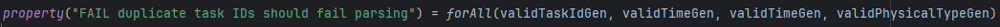

# Executive Summary

##  Milestone 2 – Property-based Tests

### Problem Overview

The project aims to develop a functional application for scheduling production orders in a factory. Each product has a linear sequence of tasks, which require specialized physical and human resources. The main objective is to generate a viable production plan based on XML data, following the principles of functional programming.

### Milestone 2 Objectives

This milestone creates properties for the problem domain.

The properties to consider are, for instance:
- The same resource cannot be used at the same time by two tasks.
- The complete schedule must schedule all the tasks of all the products needed.
   
Analyze the domain and produce other relevant properties. Properties will be valued according to their relevance to the domain.

### Development Thought

**Generators**  

Generators form a crucial component of our property-based testing strategy, enabling the creation of varied and valid data to rigorously test our domain model. Our strategy involved a bottom-up approach: we began by creating simple, atomic generators for basic types and progressively composed them into more complex generators for our core domain entities.

In our project, we implemented generators for all key domain classes related to production scheduling, such as:
- Product
- Order
- Task
- Human
- Physical Resource

The centerpiece of our generation logic is the `genProduction` generator.
It constructs a complete production scenario through dependent generation. This ensures the data is not only random but also realistic and valid. For instance:

- Dependent Generation: Tasks are generated with requirements that reference the pool of available `Physical Resources`. Products are then defined by processes that utilize these specific `Tasks`, and `Orders` are created for `Products` that exist within the same generated dataset.

- Complex Logic and Validity: Crucially, `Human Resources` are assigned skills (`Handles`) to ensure they can perform all generated tasks. We enforce this logical dependency using constraints (`.suchThat`) to guarantee that the set of required skills for all tasks is a subset of the skills possessed by the generated humans.

**Properties**

Properties define how a program should run. For example, if I give the same data twice to a given program, it's intended to make it give the same result

### ParserSpecs and assessment validation

#### PhysicalParserSpec

The `PhysicalParserSpec` is the tester for `PhysicalParser`, responsible for parsing the initial physical resources that are available.


This initial validation verifies the creation of resources for Physical elements. It is quite simple because it is not dependent on any other classes and has almost no restrictions

- we didn't develop a restriction in terms of the remaining ID or type except for the begining of the sentence. There is no need to make it be an integer or a string, it just has to be unique in ID.


The creation of multiple tasks must be enabled and it should always be possible to have multiple tasks in a single "Physicals" element.


If something is created once, it should be created exactly the same multiple times and therefore a property must be defined in that context


An ID must start with "PRST_" and therefore, if a random String is generated, most likely it won't start with these elements and the generator is correctly aligned.


A type must start with "PRST " (space included) and therefore, if a randomString is generated, most likely it won't start with these elements and the generator is correctly aligned.


Although the ID can be randomly created, it is still an identifier. Therefore, it cannot be repeated in multiple instances of "Physical" resources.


If something is created once, it should be created exactly the same multiple times and therefore a property must be defined in that context

#### HumanParserSpec

The `HumanParserSpec` is the tester for `HumanParserSpec`, which is responsible for parsing the XML data related to humans. It extracts information such as human ID, name and the resources he handles. The parsed data is transformed into an immutable `Human` model, which is used in the scheduling process.

The properties tested are the following:

```scala
property("valid id, name, and handles should parse correctly")
```
This property ensures that given a valid ID (starting with "HRS_"), a valid name, and valid resource handle types (e.g., "PRST 1" or "PRST 2"), the parser correctly processes the XML and returns the expected model without errors.

```scala
property("invalid id should fail parsing") 
```
This property checks that an ID not starting with "HRS_" is considered invalid, and the parser rejects the XML with an InvalidHumanId error.

```scala
property("invalid handle type should fail parsing")
```
This property ensures that if the resource type indicated in a <Handles> element is not in the valid set, the parser rejects the XML with an InvalidHandleType error.

```scala
property("missing name attribute should fail")
```
If the name attribute is missing from a <Human> element, the parser must fail, as the name is required for the model.

```scala
property("missing id attribute should fail")
```
Similarly, if the id attribute is missing from a <Human>, the parser must reject the XML, as the ID is mandatory.

```scala
property("Handles with no type attribute should fail")
```
A <Handles> element without the type attribute is invalid, and the parser should fail in this case.

```scala
property("parse multiple valid handles")
```
The parser should accept multiple <Handles> elements inside a single <Human>, allowing a human to handle multiple physical resource types.

```scala
property("parse human with no handles")
```
A human with no <Handles> elements is valid. The parser should return the model with an empty handles list, allowing flexibility in representation.

```scala
property("parse list of valid humans")
```
The parser should correctly process a list of multiple humans in the same XML, each with their valid properties and handles.

```scala
property("idempotency: same XML gives same result twice")
```
This property guarantees that the parser is deterministic: parsing the same XML multiple times always produces the same result, ensuring consistent behavior.

#### TaskParserSpec

The `TaskParserSpec` is the tester for `TaskParser`, which is responsible for parsing the XML data related to tasks. It extracts information such as task ID, name, duration, and the required resources (both physical and human). The parsed data is transformed into an immutable `Task` model, which is used in the scheduling process.


This spec includes more complexities because the tasks created must need existing "Physical" elements and at some point "Human" elements which can "Handle" that Physical.


The creation of multiple tasks must be enabled, and it should always be possible to have multiple tasks in a single "Tasks" element.


If something is created once, it should be created exactly the same multiple times and therefore a property must be defined in that context


The tasks must have as a start for their ID "TSK_" and the generator for this limits from starting with that string.


Thetasks must have as a start for their type "TSK " and the generator for this limits from starting with that string.


A task must be doing an already existing Physical and, if the value searched for is not the same as the one created for a "Physical", it will never give a correct answer.


A task must be handled by a human and if there are no humans that can fulfill that task, a resource must be shown as unavailable.



Although the ID can be randomly created, it is still an identifier. Therefore, it cannot be repeated in multiple instances of "Task" resources.

#### OrderParserSpec

The `OrderParserSpec` is the tester for `OrderParser`, which is responsible for parsing the XML data related to production orders. It extracts relevant information such as order ID, product ID/reference, and the quantity associated with each order. The parsed data is then transformed into an immutable `Order` model.

The properties tested are the following:

```scala
property("VALID id, product ref, and quantity should parse correctly")
```
This property ensures that given a valid order ID (starting with "ORD_"), a valid product reference from the allowed set, and a positive quantity, the parser correctly processes the XML and returns the expected Order model without errors.

```scala
property("FAIL id should fail parsing")
```
This property checks that an order ID that does not start with "ORD_" is invalid, and the parser returns an InvalidOrderId error.

```scala
property("FAIL product reference should fail parsing")
```
This property verifies that if the product reference is not part of the known valid product IDs, the parser returns a ProductDoesNotExist error.

```scala
property("FAIL quantity should fail parsing")
```
This property tests that if the quantity is zero or negative, the parser rejects the XML with an InvalidQuantity error.

```scala
property("FAIL should fail when quantity is zero or negative")
```
This is similar to the previous property, reinforcing that zero or negative quantities are invalid.

```scala
property("FAIL should handle missing prdref")
```
This property confirms that if the prdref attribute is empty, the parser treats it as an invalid product reference and returns a ProductDoesNotExist error.

```scala
property("FAIL should fail when prdref is missing")
```
This property verifies that if the prdref attribute is completely missing from the <Order> element, the parser also returns a ProductDoesNotExist error.

#### ProductParserSpec

The `ProductParserSpec` is the tester for `ProductParser`, which handles the parsing of product-related XML data. It extracts details such as product ID, name, and the sequence of tasks required for production. The parsed data is transformed into an immutable `Product` model, which is used in the scheduling process.

The tested properties ensure both positive (valid) and negative (invalid) behaviors, guaranteeing that the parser is robust under a wide range of random inputs.

The properties tested are the following:
```scala
property("valid product with taskRefs parses successfully")
```
- This property ensures that given:
  - a valid product ID (starting with "PRD_"),
  - a valid product name,
  - and a non-empty list of valid task references (starting with "TSK_"),
- the parser successfully produces a correct Product model without errors.

```scala
property("product with no taskRefs parses as empty task list")
```
- This property checks that a product without any <Process> (task references) is still valid and results in a Product model with an empty taskRefs list.

```scala
property("invalid productId should fail")
```
- This property verifies that if the product ID does not start with "PRD_", the parser correctly fails, returning an InvalidProductId error.

```scala
property("invalid taskRef id should fail")
```
- This property ensures that if the product contains <Process> elements with task references not present in the valid task list, the parser fails with a TaskDoesNotExist error.

```scala
property("missing id attribute should fail")
```

- This property checks that if the <Product> element is missing the id attribute, the parser correctly identifies it as invalid and fails.

```scala
property("missing name attribute should fail")
```
- This property ensures that if the <Product> element is missing the name attribute, the parser also fails, since both id and name are mandatory.

```scala
property("idempotency: same XML gives same result")
```
- This property guarantees determinism: parsing the same XML multiple times always gives the same result, ensuring consistent parser behavior.
- 
#### ProductionParserSpec

The `ProductionParserSpec` is the for `ProductionParser`, which represents the concatenation of all the parsers until now. 

ecause it depends on the successful parsing of all these components, this parser’s correctness is critical: if any subcomponent fails, the full production parsing must also fail.

The properties tested are the following:

```scala
property("valid production should parse successfully")
```
- This property ensures that when all components are present and valid:

  - Physical resources,

  - Tasks (with correct references to physical resources),

  - Humans (with matching handles),

  - Products (with valid task references),

  - Orders (with valid product references),

- The parser successfully produces a complete Production object.

```scala
property("missing Products node should fail")
```
- This property checks that if the <Products> section is missing from the XML, the parser correctly fails, because the production cannot exist without defined products.

```scala
property("order referencing unknown product should fail")
```
- This property verifies that if an order refers to a product ID not present in the <Products> section, the parser fails with a ProductDoesNotExist error.

```scala
property("idempotency: same XML gives same result")
```
- This property guarantees determinism: parsing the same production XML multiple times always yields the same result, ensuring consistent parser behavior.


#### SchedulePropertySpec
The SchedulePropertySpec is the property-based test suite for generating task schedules (TaskSchedule) from a production model (Production). Its purpose is to ensure that the scheduling respects fundamental rules.

The properties tested are the following:

```scala
property("no overlapping use of physical resources on generated productions")
```
This property ensures that there is no temporal overlap in the use of physical resources during scheduled tasks, meaning no physical resource is used by two tasks simultaneously.

```scala
property("no overlapping use of human resources")
```
This property verifies that human resources do not have scheduling conflicts, ensuring each person is assigned to only one task at any given time.

```scala
property("all tasks referenced in product processes are scheduled")
```
This property confirms that all tasks referenced in the product processes related to orders are actually scheduled.

```scala
property("each task schedule duration matches task time")
```
This property guarantees that the duration of each task schedule matches exactly the time specified for that task in the production model.

```scala
property("all scheduled physical resources exist in production")
```
This property checks that all physical resources used in the scheduled tasks exist in the set of physical resources defined for the production.

```scala
property("task order in product process is respected")
```
This property ensures that the task order defined in the product processes is respected in the schedule — that is, tasks are performed in the correct sequence.

```scala
property("no overlapping tasks in the schedule overall")
```
This property verifies that, overall, scheduled tasks do not overlap in time on the global schedule.

```scala
property("tasks are repeated according to order quantity")
```
This property confirms that tasks are repeated in the schedule the expected number of times, according to the quantity of each order and the number of tasks in the product.

### Alternatives or improvements

#### Concatenation of concerns

Separation of concerns is a design pattern used and described as an efficient and maintainable method, but there could be everything concatenated.

This would not be a good alternative because separating concerns is the best way to adapt a system to a new given situation.

#### Time-based organization

The time to execute a schedule is the highest when ordering in FIFO, but if we were to implement a way to get from all the possible schedules the one who is more time efficient could be a valued increase.

This would be a good alternative but right now it was asked for us to develop a FIFO methodology for our method.

#### Expanding error's horizon

Instead of processing the data and throwing the errors straight on the parser, some of the errors (for example, ResourceUnavailable) could be captured outside the parser, but on the execution of the calculus made of the task schedules.

This would improve the readability and understanding of some errors, but it would be bad especially on execution time. The earlier the error is located, the faster the response.
